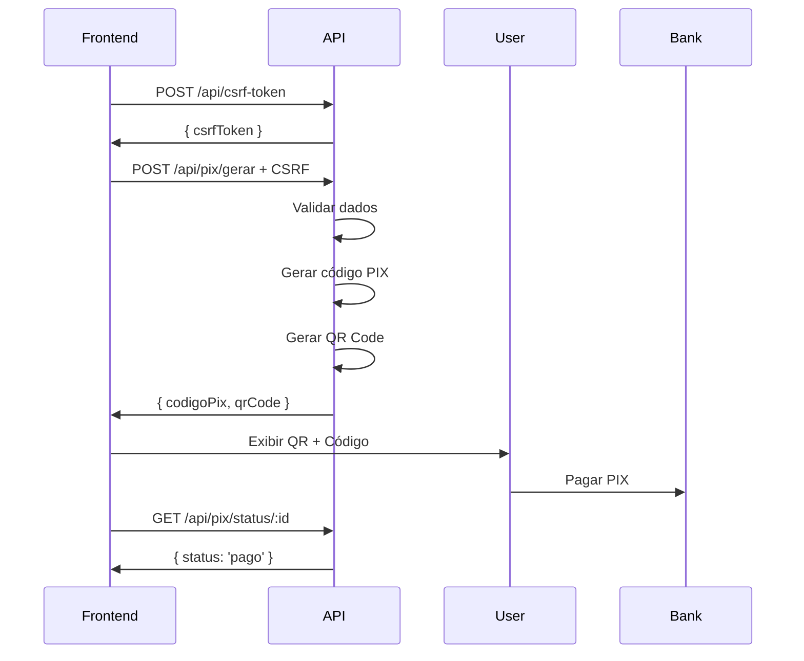

# 📚 FETIN API - Documentação Técnica Completa

## 🎯 Visão Geral

A FETIN API é uma solução completa de marketplace que oferece:
- Sistema de pagamentos PIX integrado
- Autenticação segura com JWT
- CRUD completo para múltiplos módulos
- Proteções de segurança avançadas
- Testes automatizados abrangentes

## 🏗️ Arquitetura

```
API/
├── config/          # Configurações (DB, etc)
├── controllers/     # Lógica de negócio
├── middlewares/     # Middlewares (auth, security, etc)
├── models/          # Modelos do MongoDB
├── routes/          # Definição de rotas
├── tests/           # Testes automatizados
├── index.js         # Aplicação principal
└── server.js        # Servidor HTTP
```

## 🔐 Sistema de Autenticação

### **Fluxo de Autenticação**
1. **Registro** → Gera JWT token
2. **Login** → Valida credenciais + retorna token
3. **Requests** → Token no header `Authorization: Bearer <token>`

### **Middleware de Autenticação**
```javascript
// Todas as rotas protegidas usam:
const autenticarToken = require('./middlewares/authMiddleware');

// Validação automática de:
// - Presença do token
// - Validade do token
// - Estrutura do token
// - Expiração
```

### **Roles de Usuário**
- `cliente` - Usuário padrão
- `vendedor` - Pode vender produtos
- `prestador` - Oferece serviços
- `admin` - Acesso administrativo

## 💳 Sistema PIX - Detalhes Técnicos

### **Geração de Código PIX**
```javascript
// Formato EMV (Europay, Mastercard, Visa)
const gerarCodigoPix = (dados) => {
  let codigo = '';
  codigo += '000201';                    // Payload Format Indicator
  codigo += '010212';                    // Point of Initiation Method
  codigo += `26${chavePixFormatada}`;    // Merchant Account Information
  codigo += '52040000';                  // Merchant Category Code
  codigo += '5303986';                   // Transaction Currency (BRL)
  codigo += `54${valor}`;                // Transaction Amount
  codigo += '5802BR';                    // Country Code
  codigo += `59${merchantName}`;         // Merchant Name
  codigo += `60${merchantCity}`;         // Merchant City
  codigo += '6304';                      // CRC16 (simplificado)
  return codigo;
};
```

### **QR Code**
- **Biblioteca**: `qrcode`
- **Formato**: Base64 Data URL
- **Tamanho**: 300x300px
- **Margem**: 2px

## 🛡️ Segurança Implementada

### **1. Proteção CSRF**
```javascript
// Middleware CSRF
const csrfProtection = {
  generateToken: (req, res, next) => { /* ... */ },
  validateToken: (req, res, next) => { /* ... */ }
};

// Aplicado em todas as rotas POST/PUT/DELETE
router.post('/', auth, csrf.validateToken, controller.create);
```

### **2. Rate Limiting**
```javascript
// 100 requests por 15 minutos
const rateLimit = require('express-rate-limit');
const limiter = rateLimit({
  windowMs: 15 * 60 * 1000, // 15 minutos
  max: 100 // máximo 100 requests
});
```

### **3. Mass Assignment Protection**
```javascript
// Whitelist de campos permitidos
const allowedFields = ['title', 'description', 'price'];
const updateData = {};

allowedFields.forEach(field => {
  if (req.body[field] !== undefined) {
    updateData[field] = req.body[field];
  }
});
```

### **4. Validação de Dados**
```javascript
// ObjectId validation
const validateObjectId = (id) => {
  return mongoose.Types.ObjectId.isValid(id);
};

// Email validation
const validateEmail = (email) => {
  return /^[^\s@]+@[^\s@]+\.[^\s@]+$/.test(email);
};
```

## 📊 Modelos de Dados

### **User Schema**
```javascript
{
  email: { type: String, required: true, unique: true },
  password: { type: String, required: true },
  fullName: { type: String, required: true },
  roles: { type: [String], default: ['cliente'] },
  phone: String,
  address: AddressSchema,
  sellerInfo: { /* dados do vendedor */ },
  serviceProviderInfo: { /* dados do prestador */ },
  createdAt: { type: Date, default: Date.now },
  updatedAt: { type: Date, default: Date.now }
}
```

### **Transacao Schema (PIX)**
```javascript
{
  userId: { type: ObjectId, ref: 'User', required: true },
  type: { type: String, enum: ['pix', 'credit_card'], required: true },
  currency: { type: String, enum: ['BRL'], default: 'BRL' },
  amount: { type: Number, required: true, min: 0.01 },
  status: { 
    type: String, 
    enum: ['pending', 'completed', 'failed'], 
    default: 'pending' 
  },
  paymentGatewayTransactionId: String,
  createdAt: { type: Date, default: Date.now }
}
```

## 🔄 Fluxos de Negócio

### **Fluxo PIX Completo**


### **Fluxo de Autenticação**
```mermaid
sequenceDiagram
    Frontend->>API: POST /api/auth/login
    API->>DB: Validar credenciais
    DB->>API: Usuário válido
    API->>API: Gerar JWT token
    API->>Frontend: { token, user }
    Frontend->>API: Requests com Bearer token
    API->>API: Validar token
    API->>Frontend: Dados solicitados
```

## 🧪 Estratégia de Testes

### **Estrutura de Testes**
```
tests/
├── setup.js           # Configuração global
├── auth.test.js       # Testes de autenticação
├── pix.test.js        # Testes do sistema PIX
├── automovel.test.js  # Testes CRUD automóveis
├── imovel.test.js     # Testes CRUD imóveis
└── ...                # Outros módulos
```

### **Padrão de Teste**
```javascript
describe('Módulo X', () => {
  let token;

  beforeAll(async () => {
    // Setup: criar usuário e obter token
    const userRes = await request(app)
      .post('/api/auth/register')
      .send(testUser);
    token = userRes.body.token;
  });

  test('Operação Y', async () => {
    const res = await request(app)
      .post('/api/endpoint')
      .set('Authorization', `Bearer ${token}`)
      .send(testData);
    
    expect(res.statusCode).toBe(200);
    expect(res.body).toHaveProperty('expectedField');
  });
});
```

## 📈 Performance e Otimização

### **Database Indexing**
```javascript
// Índices recomendados
UserSchema.index({ email: 1 });
TransacaoSchema.index({ userId: 1, createdAt: -1 });
AutomovelSchema.index({ postedBy: 1, createdAt: -1 });
```

### **Caching Strategy**
```javascript
// Headers de cache para recursos estáticos
app.use('/static', express.static('public', {
  maxAge: '1d',
  etag: true
}));
```

### **Pagination**
```javascript
// Implementar paginação em listagens
const page = parseInt(req.query.page) || 1;
const limit = parseInt(req.query.limit) || 10;
const skip = (page - 1) * limit;

const results = await Model.find()
  .skip(skip)
  .limit(limit)
  .sort({ createdAt: -1 });
```

## 🔧 Middleware Stack

### **Ordem de Middlewares**
```javascript
app.use(securityLogger);        // 1. Logs de segurança
app.use(securityHeaders);       // 2. Headers de segurança
app.use(generalRateLimit);      // 3. Rate limiting
app.use(cors());                // 4. CORS
app.use(express.json());        // 5. Body parser
app.use('/api/auth', authRoutes); // 6. Rotas públicas
app.use('/api/*', authMiddleware); // 7. Rotas protegidas
app.use(errorHandler);          // 8. Error handler (último)
```

## 🚨 Tratamento de Erros

### **Error Handler Global**
```javascript
const errorHandler = (err, req, res, next) => {
  // Log estruturado
  console.error('🚨 [ERROR]', {
    message: err.message,
    stack: err.stack,
    url: req.url,
    method: req.method,
    ip: req.ip
  });

  // Resposta padronizada
  res.status(err.statusCode || 500).json({
    success: false,
    error: err.message || 'Erro interno do servidor'
  });
};
```

### **Tipos de Erro Tratados**
- **ValidationError** → 400 Bad Request
- **CastError** → 400 Bad Request (ObjectId inválido)
- **11000** → 400 Bad Request (Duplicação)
- **JsonWebTokenError** → 401 Unauthorized
- **TokenExpiredError** → 401 Unauthorized

## 📊 Monitoramento

### **Logs de Segurança**
```javascript
// Eventos logados automaticamente
- Tentativas de autenticação
- Operações sensíveis
- Erros 401/403
- Erros 500+
- Rate limiting ativado
```

### **Health Check**
```javascript
GET /api/health
{
  "status": "Servidor rodando",
  "timestamp": "2024-01-01T12:00:00.000Z",
  "uptime": 3600,
  "memory": { "used": "50MB", "total": "512MB" }
}
```

## 🔄 Versionamento da API

### **Estratégia de Versioning**
- **URL Path**: `/api/v1/endpoint`
- **Header**: `Accept-Version: v1`
- **Backward Compatibility**: Manter v1 por 6 meses

### **Changelog**
- **v1.0.0** - Release inicial
- **v1.1.0** - Sistema PIX adicionado
- **v1.2.0** - Melhorias de segurança

## 🚀 Deploy e DevOps

### **Ambientes**
- **Development** - `NODE_ENV=development`
- **Staging** - `NODE_ENV=staging`
- **Production** - `NODE_ENV=production`

### **Variáveis por Ambiente**
```bash
# Development
MONGO_URI=mongodb://localhost:27017/fetin_dev
JWT_SECRET=dev_secret_key

# Production
MONGO_URI=mongodb://cluster.mongodb.net/fetin_prod
JWT_SECRET=super_secure_production_key_32_chars
```

### **CI/CD Pipeline**
```yaml
# .github/workflows/api.yml
name: API Tests
on: [push, pull_request]
jobs:
  test:
    runs-on: ubuntu-latest
    steps:
      - uses: actions/checkout@v2
      - uses: actions/setup-node@v2
      - run: npm install
      - run: npm test
      - run: npm run test:coverage
```

---

**Documentação atualizada em:** Janeiro 2024  
**Versão da API:** v1.2.0  
**Autor:** Equipe FETIN